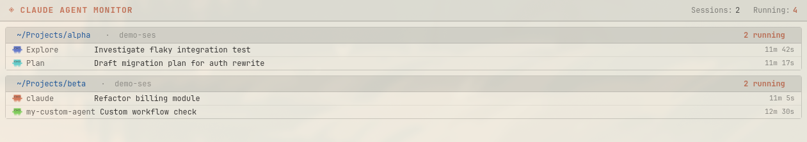

# Claude Agent Monitor

A live view of the sub-agents [Claude Code](https://claude.com/claude-code) spawns — as a GTK4 window and a [Waybar](https://github.com/Alexays/Waybar) module. It tracks every sub-agent across sessions, shows only the ones currently running, and drops each one the moment it finishes.



## Features

- Tracks all sub-agents Claude Code spawns, across every session
- Shows only **running** agents; finished ones disappear from the view
- Each row shows a color-coded Claude mascot (by agent type), the description, and elapsed time
- Waybar module with a live running-count and tooltip
- Built for Hyprland / [Omarchy](https://omarchy.org), but runs on any Wayland or X11 GTK4 desktop

## Requirements

- Linux with **GTK 4** and **PyGObject** (system packages — not pip-installable)
- **librsvg** (renders the SVG mascots)
- Python ≥ 3.11
- Optional: **Waybar** (bar module), **Hyprland** (window rules)

On Arch:

```bash
sudo pacman -S python-gobject gtk4 librsvg
```

## Install

### AUR (recommended)

```bash
yay -S claude-agent-monitor-git
```

### From source

GTK/PyGObject must come from the system, so the virtualenv needs `--system-site-packages`:

```bash
git clone https://github.com/pongvivatt/claude-subagent-monitor
cd claude-agent-monitor
python -m venv --system-site-packages .venv
.venv/bin/pip install -e .
```

## Setup

### 1. Register the Claude Code hook

```bash
claude-agent-monitor install-hooks
```

This adds `PreToolUse`, `PostToolUse` (matcher `Agent`) and `SessionEnd` hooks to `~/.claude/settings.json`, backing up any existing file first. It is idempotent and reversible:

```bash
claude-agent-monitor uninstall-hooks
```

**Restart your Claude Code sessions** afterward — hooks load at session start. Run `claude-agent-monitor setup` to print every config snippet (including the manual hook JSON).

### 2. Waybar module

`~/.config/waybar/config.jsonc`:

```jsonc
"custom/claude-agent-monitor": {
    "exec": "claude-agent-monitor-waybar",
    "return-type": "json",
    "interval": 2,
    "on-click": "claude-agent-monitor",
    "tooltip": true
}
```

`~/.config/waybar/style.css`:

```css
#custom-claude-agent-monitor { color: #CC785C; }
#custom-claude-agent-monitor.active {
    background: #CC785C;
    color: #FFFCF0;
    border-color: #CC785C;
}
```

Restart Waybar (`omarchy restart waybar`, or your usual command).

### 3. Hyprland window rules (optional)

`~/.config/hypr/hyprland.conf`:

```conf
windowrulev2 = float,  title:^(Claude Agent Monitor)$
windowrulev2 = size 760 480, title:^(Claude Agent Monitor)$
windowrulev2 = move 100%-780 60, title:^(Claude Agent Monitor)$
```

## Commands

| Command | What it does |
|---|---|
| `claude-agent-monitor` | Open the monitor window |
| `claude-agent-monitor-waybar` | Print the Waybar JSON (one shot) |
| `claude-agent-monitor setup` | Print all config snippets |
| `claude-agent-monitor install-hooks` | Register the hook in `~/.claude/settings.json` |
| `claude-agent-monitor uninstall-hooks` | Remove the hook again |
| `claude-agent-monitor seed` | Populate demo data for a visual test |

## How it works

Claude Code fires `PreToolUse` / `PostToolUse` hooks around the `Agent` tool. The hook writes a small JSON state file at `~/.local/share/claude-agent-monitor/state.json` (under a file lock, via atomic replace). The GTK window and the Waybar module poll that file — the window lists running agents, and finished agents are filtered out. A `SessionEnd` hook clears a session's agents when it closes (so agents still running at close don't linger); sessions idle for 10 minutes are pruned, and any agent stuck `running` for more than 15 minutes is auto-closed — both serve as backstops for sessions killed abruptly.

## License

[MIT](LICENSE)
